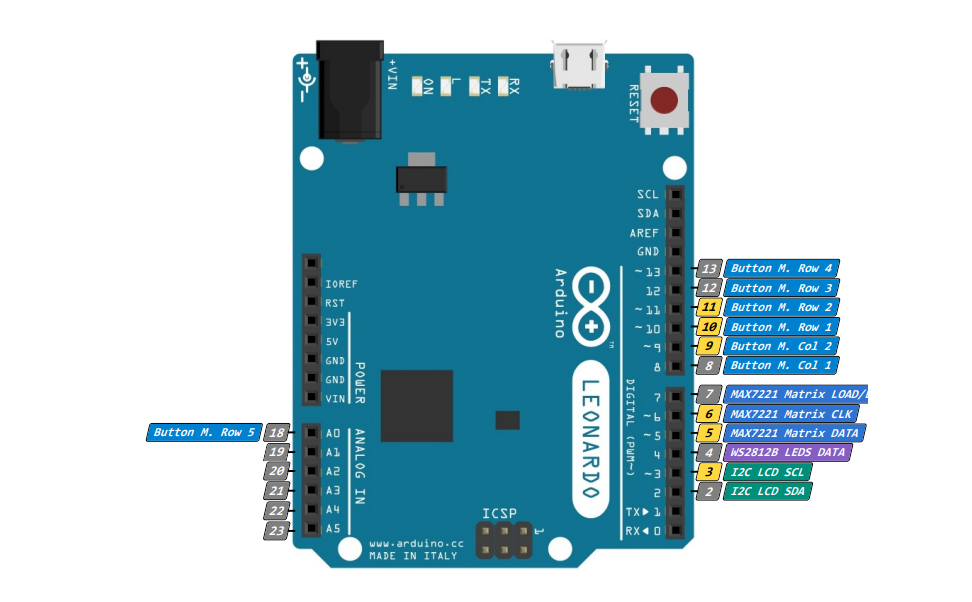

# GostergeAndButtonBoxV1
Bu depoda sizlere oyunlar için hem gösterge hem de ButtonBox olarak çalışan bir sistemin nasıl yapılacağını anlattım.

# Başlamadan önce...

Bu proje için kullanılan yazılım her oyunu desteklemez. Desteklenilen oyunlar listesi için [burayı](https://www.simhubdash.com/supported-games/ "SimHub desteklenen oyunlar listesi") ziyaret edin. Ayrıca 3D Model ve Pleksi Lazer Kesim için gereken dosyalar depoda mevcuttur.

# Hazırlıklar

### Donanım için gerekenler : 

- Herhangi bir Arduino kartı (Eğer ButtonBox özelliğini istiyorsanız Arduino Leonardo ya da Pro Micro kullanmalısınız, diğer kartlar ButtonBox özelliğini tam olarak desteklemiyor.)
- 10 adet DC184 buton (Bu butonları pleksi üzerindeki buton deliklerinin yarıçapını değiştirerek güncelleyebilir ya da ek yapabilirsiniz.)
- 4*20 LCD Ekran (2*16 LCD ekran kullanılamaz.)
- LCD Ekran için I2C Modülü (ZORUNLU)
- 2 adet WS2812B RGB LED Stick
- 8*8 Dot Matrix (Kartı ile beraber)
- Mini Breadboard
- Bir sürü Jumper Kablo
- Pleksi Levha (Lazer kesim dosyası aşağıdadır.)
- 3B model parçalar (3D Baskı hizmeti veren bir yerden temin edebilirsiniz ya da fotoblok kullanabilirsiniz.)
- 4 adet M3 4mm'lik vida 
- 4 adet M3 somun
- 4 adet M3 8mm Erkek - Dişi Aralayıcı

### Yazılım için gerekenler : 

Proje yazılımı için SimHub adlı uygulamaya ihtiyacımız var. [Bu bağlantıdan](https://www.simhubdash.com/download-2/ "SimHub indirme linki") indirebilir ve bilgisayarınıza kurabilirsiniz.

# Yapım Aşaması

1. Öncelikle devreyi kurun. Ben bu şekilde kurdum. Siz güncelleyebilirsiniz fakat bunları kodda güncellemeyi unutmayın. (LCD Ekran pinlerini değiştiremezsiniz. Sadece arduino modeli değişirse pinler değişir.) Butonların neden bu şekilde olduğuna dair bir sorunuz olacaktır. Butonları MATRIX dediğimiz bağlantı türü ile bağlayarak pin kullanımını azalttık. İnternetten araştırarak ya da nasıl bağlayacağınızı bana sorarak öğrenebilirsiniz.
2. Kurduğumuz devreye yazılım atalım. Öncelikle SimHub programını açarak Arduino sekmesine, oradan da My Hardware sekmesine girerek "Open Arduino Setup Tool" butonuna tıklayarak yazılım atmaya hazırlanıyoruz. Açılan pencereden aşağıdaki değişiklikleri yapın: 
- GAMEPAD : ON 
- MAX 7221 : ON (Pin verileri fotoğraftaki gibi girilmeli)
- WS2812B : 16 ADET LED, 4. PIN, GRB ENCODING
- I2C LCD : ON (Pin verileri fotoğraftaki gibi girilmeli, ayrıca I2C adresi de I2C kartına uygun olarak yazılmalıdır. Öğrenmek için Google'a "I2C adress test on arduino" yazabilirsiniz. I2C Kütüphanesi PCF8574T olarak seçilmelidir.)
- BUTTON MATRİX : ON (Pin verileri fotoğraftaki gibi girilmeli, 2 COLUMNS - 5 ROWS)
Bu değişiklikleri yaptıktan sonra sağ kısımdan kullandığınız Arduino kartını ve port numarasını doğru olarak seçmeli ve "I understand that uploading..." yazan kutucuğu işaretleyerek karta yazılım yüklemesi yapmalısınız. Bu sayede karta yazılımını yüklemiş oluyorsunuz.
3. Kurduğunuz devreyi, baskısını aldığınız 3D model ya da fotoblokla beraber pleksi levhaya montajlamanız gerekiyor. Bu noktada el işçiliğiniz önemli bir görev teşkil ediyor. Parçaları dikkatli bağlamanızda fayda var.
4. Projenize güç vererek test edin. Eğer herhangi bir kısa devre problemi yoksa (NOT : PROJE OYUN SIRASINDA ÇOK GÜÇ ÇEKEBİLİR, AYRI BİR GÜÇ KAYNAĞI BAĞLAMAYIN KARTI YAKARSINIZ) projeniz neredeyse hazır durumdadır.
5. Projenizdeki parçaların neler yapabileceği ya da göstereceği bilgisini güncelleyebilirsiniz!
- ##### BUTONLAR : SimHub uygulamasından "Control and Events" sekmesine gidin. Oradan da "Keyboard emulation" sekmesine gidin. "Add mapping" butonuna tıklayarak her buton için ayrı bir harf, karakter ya da numara atayabilirsiniz. Input kısmındaki "Click to configure" metnine tıkladığınızda açılan pencerede kullanmak istediğiniz butona basarak Buton bilgisini verebilir, hangi durumlarda çalışacağını liste kutucuğundan seçebilirsiniz. "Simulated Keys" kısmına da butona göre klavyede bastırmak istediğiniz tuş bilgisini verebilirsiniz.
- ##### LCD / RGB LED / DOT MATRIX : SimHub uygulamasındaki "Arduino" sekmesindeki "Screens" ile LCD Ekran'a veri göndermeyi, "RGB LEDs" özelliği ile WS2812B Sticklere veri göndermeyi, "Display & Alerts" sekmesinden de Dot Matrix'e vites verisini gönderebilirsiniz.

Bunlarla ilgili detaylar aşağıdadır.

